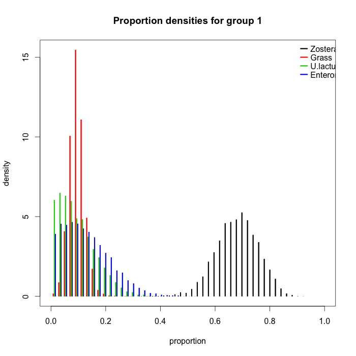
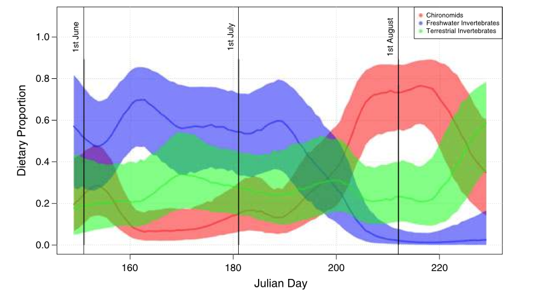

## Lecture Topics

- Why use a Stable Isotope Mixing Model
- Introduction to Bayesian statistics
- Regression models and SIMMS
- Dos and Donts of using SIMMS
- Statistical model behind SIAR / simmr / MixSIAR
- Stable Isotope Bayesian Ellipses (SIBER)
- Estimating Trophic Discrimination Factors with SIDER
- SIAR Vs simmr Vs MixSIAR
- SIMMS for complex data
- Source grouping
- Building your own SIMM with jags

## Practicals
- R revision
- SIAR / simmr
- SIBER
- SIDER
- MixSIAR and jags

## Questions ecologists often ask

> - What is this animal eating?
> - Are these animals specialists or generalists?
> - Why are these populations of animals eating different things?
> - How is this community functioning?

## Isotopes can provide insights


## Moving heavy isotopes is hard work


## Heavy isotopes are chemically sticky


## Observe the states and infer the process


## Ecological process inferred by isotopes
- <div style="ref">Newsome, Martinez del Rio, Bearhop & Phillips. 2007. A Niche for Isotopic Ecology. Frontiers in Ecology and the Environment.</div> 
- d-space and p-space


## Mixing Models move from d- to p-space
- Direct measure of trophic interactions via consumption


## Determined system - 2 sources 1 tracer

> - How much of black and blue is the red dot made of?
> - ``` consumer = (1/3)*(-10) + (2/3)*(5) = 0```

```{r, echo=FALSE, message=FALSE, fig.width = 8, fig.height = 4}
plot(c(-10, 0, 5), c(0,0,0), pch = c(15,16,15), col = c(1,2,4),
     xlab = "", ylab = "", bty="L", cex = 4, ylim = c(-0.5, 0.5), yaxt = "n")
```

## Determined system - 3 sources 2 tracers
> - How much of black, blue and magenta is the red dot made of?
> - ``` p = c(0.2, 0.4, 0.4) ```

```{r, echo=FALSE, message=FALSE, fig.width = 8, fig.height = 4}

s1 <- c(-10, 2)
s2 <- c(0, 8)
s3 <- c(5, 3)

sources <- rbind(s1, s2, s3)

p <- c(0.2, 0.4, 0.4)

consumer <- p %*% sources

plot(sources[,1], sources[,2], pch = c(15,15,15), col = c(1,6,4),
     xlab = "", ylab = "", bty="L", cex = 4, asp = 1, xlim = c(-12,6),
     ylim = c(0, 10))
points(consumer[1], consumer[2], pch = 16, col = 2, cex = 4)
```

## Under-determined - 3 sources 1 tracers
> - problems arise
> - ``` 1/3 black + 2/3 blue ```
> - ``` 1/6 black + 5/6 magenta ```
> - ``` 1/3 black + 1/6 magenta + 3/5 blue```

```{r, echo=FALSE, message=FALSE, fig.width = 8, fig.height = 2.5}
plot(c(-10, 0, 2, 5), c(0,0,0,0), pch = c(15,16,15,15), col = c(1,2,6,4),
     xlab = "", ylab = "", bty="L", cex = 4, ylim = c(-0.5, 0.5), yaxt = "n")
```


## Under-determined - 4 sources 2 tracers
> - similar issue but more nuanced


```{r, echo=FALSE, message=FALSE, fig.width = 8, fig.height = 4}

s1 <- c(-10, 2)
s2 <- c(0, 8)
s3 <- c(5, 3)
s4 <- c(-5, 8)

sources <- rbind(s1, s2, s3, s4)

p <- c(0.2, 0.4, 0.4, 0)

consumer <- p %*% sources

plot(sources[,1], sources[,2], pch = c(15,15,15, 15), col = c(1,6,4,5),
     xlab = "", ylab = "", bty="L", cex = 4, asp = 1, xlim = c(-12,6),
     ylim = c(0, 10))
points(consumer[1], consumer[2], pch = 16, col = 2, cex = 4)
```

## IsoSource


> - took a brute force approach
> - try every possible combination of sources in 1% increments
> - accept if within some treshold of the mixture (consumer)
> - reject if outside treshold

## SIAR / MixSIR / MixSIAR



> - uses Bayesian Inference to assign probabilities to the estimates
> - frequency of occurrence, and proximity of estimate to the observed value increases the probability of a solution
> - can also include prior information that weights the probability of a solution


## Comparing dietary proportions

- Proportion of terrestrial grass in the diet of Brent geese


## Diet over time

- Diet can be linked to covariates such as time



## Inference from d-space

> - Isotopes are like naturally occurring PCA analyses
> - They are two axes, behind which lie multiple biotic and physical factors
> - d15N tells us a lot about trophic level for example
> - d13C can tell us about marine Vs terrestrial among other scenopoetic factors
> - Idea is that isotopic niche correlates in some way with ecological niche

## Specialists Vs generalists


<div class="ref">Bearhop, Adam, Waldron, Fuller & MacLeod. 2004. Determining trophic niche width: a novel approach using stable isotope analysis. J Anim Ecol.</div>

## Drivers of niche width


<div class="ref">Layman et al. 2007. Niche width collapse in a resilient top predator following ecosystem fragmentation.</div>

## Invasive species


<div class="ref">Jackson, M.C. et al. 2012. Population-Level Metrics of Trophic Structure Based on Stable Isotopes and Their Application to Invasion Ecology. PLoSONE. </div>

## The question is key
> - as with all science, your question will determine which analysis you require
> - formulating a clear question at the start will inform your study design
> - If you need to know what an animal is eating, then you require a SIMM
> - if you want to compare the niche widths of populations then you probably want the ellipse functions in SIBER
> - if you want to compare entire communities for niche structure, then you probably want the hull-based metrics in SIBER