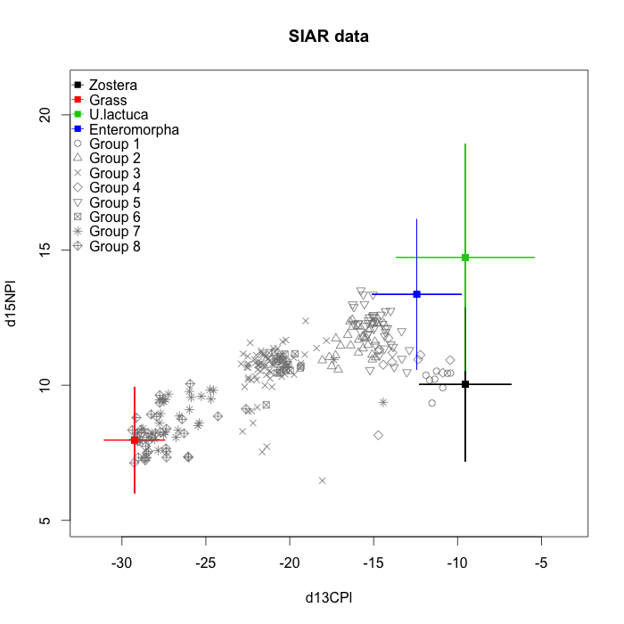
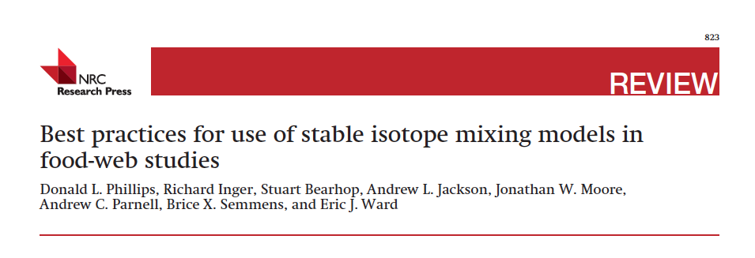
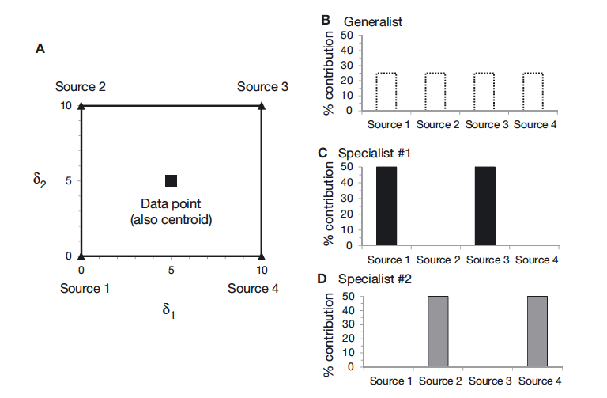
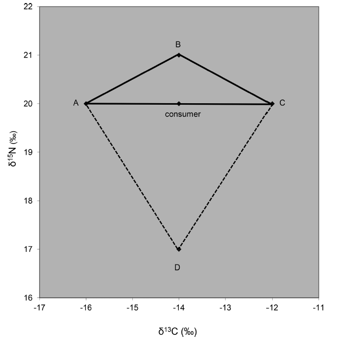
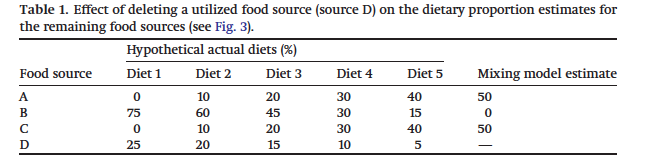
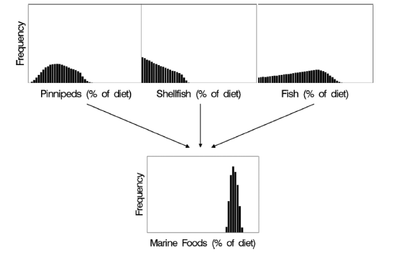
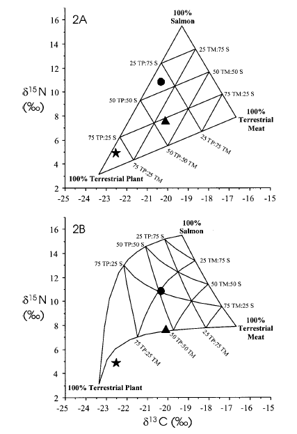
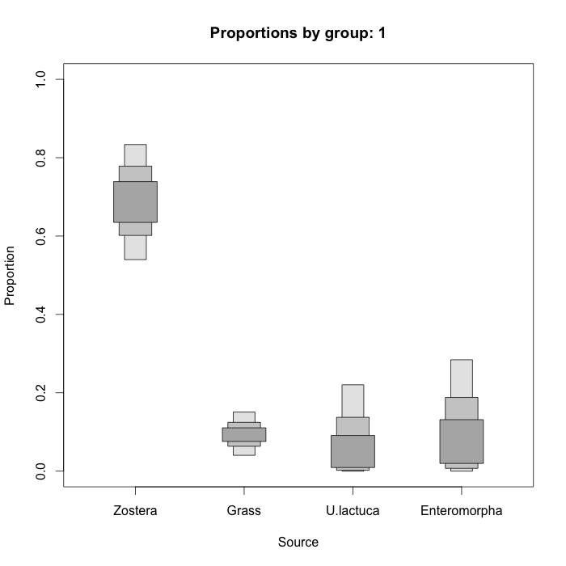
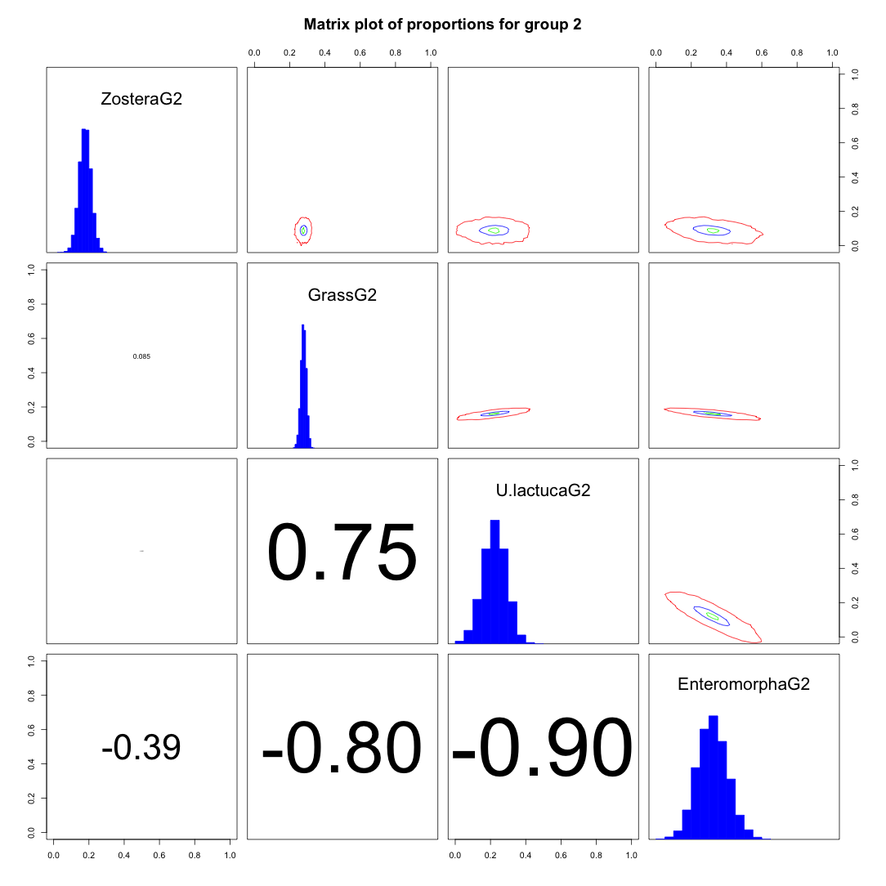

## Basic Mixing Model Assumptions




> - All sources are known
> - Source means are known
> - TEFs are known
> - Sources are distinct

## Additional Biological Assumptions

> - Consumer tissue sampled at appropriate time relative to sources
> - Consumer is at equilibrium with their food
> - TEF is a fair reflection of consumer physiology
>     - fasting
>     - high carbon / nitrogen diets
>     - reproduction
>     - growth
>     - hibernation
>     - migration
    
## Some (11) Dos and don'ts of mixing models




## A priori questions - 1
> - The general question "What does this/these animal(s) eat?" is commonplace
    - can suffer from uncertainties
    - especially if restricted to individual animals
    - restricted to one point in time
> - Might be more powerful to ask:
    - do these animals differ in their diet of Source A?
    - how does their diet vary over time?

## Consider diet - 2
>- Consider what is known about the animal's diet
 > - you need to know all the food sources they eat
 > - A SIMM can then tell you what proportion of each occurs in their diet
 > - Provides a longer term average than say gut or faeces contents analysis

## Sample collection - 3a
> - tissue in the consumer takes time to made from the assimilated material
>     - some tissue has a fast turn-over, and some can be very slow
>     - may never actually be in equilrium with their food
> - important therefore to sample sources at the time the tissue was laid down
>     - blood plasma is practically instantaneous (a few days)
>     - blood cells a week or two
>     - feathers and scales could be months old
>     - important to think about the biology of your organisms
    
## Sample collection - 3b


> - Sources may vary in isotopic concentrations over time
> - Sources likely vary through space
> - Getting a good picture of this variation, and including it in the modelling process is very important
> - How many source samples will you take?
> - particularly when you have hierarchically nested populations of consumers, the number of samples at each level can have a large effect on precision of estimated diets [Semmens et al 2009](http://www.ncbi.nlm.nih.gov/pubmed/19587790).

## Enrichment factors - 4a

- "you are what you eat plus a few per-mil"
    - the ___plus___ represents what your physiology is doing to the isotopic ratios as they are processed into tissue
    
```{r, echo=FALSE, message=FALSE, fig.width = 3.5, fig.height = 3.5}

s1 <- c(-10, 2)
s2 <- c(0, 8)
s3 <- c(5, 3)

sources <- rbind(s1, s2, s3)

p <- c(0.2, 0.4, 0.4)

consumer <- p %*% sources

plot(sources[,1], sources[,2], pch = c(15,15,15), col = c(1,6,4),
     xlab = "", ylab = "", bty="L", cex = 3, xlim = c(-12,6),
     ylim = c(-5, 10))
points(consumer[1], consumer[2], pch = 16, col = 2, cex = 3)
points(sources[,1] - 1, sources[,2] - 3,
       pch = c(0,0,0), col = c(1,6,4), cex = 3)
```


    
## Enrichment factors - 4b
> - Enrichment / Discrimination factors are best added to sources allowing differences depending on the source
> - They vary a lot among tissues, individuals and species
> - Some people worry about internal routing
    - different nutrients are sent along different pathways depending on physiological state of the organism and anabolic processes (building of tissues)
> - My own view that the uncertainty one includes encompasses all these concerns
> - We are working on a neat method to estimate these factors on species for which we dont have observed factors: SIDER

## Plot your data - 5a


## Plot your data - Fry's concerns - 5b


> - Fry, B. 2013. Alternative approaches for solving underdetermined isotope mixing problems. MEPS.
> - Brett, M. 2016. Resource polygon geometry predicts Bayesian stable isotope mixing model bias. MEPS.
> - these are over-simplifications as we will see later in the course when we remember to look at the full posterior estimates and not just focus on the means
> - Brett used simulations of only a single consumer to show that the prior dominates the solutions...

## Include sources in an informed way - 6

<center></center>


## Consider grouping sources - 7a


> - Temptation might be to aggregate nearby sources (blue and green)
> - Gain is to go from under- to fully-determined system (+/- the uncertainty)
> - It falsely increases precision
> - However in this case it could be justified as _U. lactuca_ and _Enteromorpha sp_ are actually the same species


## Consider grouping sources - 7b


> - better to aggregate after fitting a SIMM
> - can gain remarkably increased precision about a less detailed question

## Elemental concentration - 8a



> - Not all sources have same concentration of elements
    - Berries are nearly all carbon
    - Flesh is mostly nitrogen
> - Consuming equal proportions of each source by bulk mass can lead to more carbon influence from the carbon rich source
> - Considering this concentration dependence can warp the mixing polygon
> - Phillips & Koch. 2002. Incorporating concentration dependence in stable isotope mixing models

## Isotope routing - 8b
> - related to concentration dependence effects, once assimilated, different molecules get sent through different pathways en route to tissue formation. 
> - more of the assimilated carbon might go one route
> - while more of the nitrogen might go elsewhere
> - ultimately tissues can then end represented by up more or less of the carbon or nitrogen signal
> - balance can be shifted by physiologicla state, such as reproduction, fasting or gorging.
> - generally not well understood, so best advice is to pick appropriate discrimimation factor and add uncertainty

## Incorporate uncertainty - 9
> - Estimate mean consumer diet +/- error
> - **SIAR** pushes this error to residual error
> - **MixSIR** pushes it on the proportions
> - Uncertainty on Sources
> - specified as sd in **SIAR** / **MixSIR**
> - can be estimated from data in ***MixSIAR***
> - Discrimination / Enrichment Factors
> - specified as sd
> - No errors on Concentrations in current formulations

## Report distributions of results - 10a



> - mode
> - median
> - mean
> - credible intervals

## Report distributions of results - 10a



> - negative correlations imply inability to discern between sources
    - consider a posteriori aggregation
    - the negative correlation can shrink their combined variance
    - ```var(a+b) = var(a) + var(b) + 2*(cov(a,b))```
> - positive correlations indicate solutions where increasing one source requires inclusion of another
    - e.g. diametrically opposed sources


## Limitations - 11
> - Geometry of your data
> - Biology
> - The fitting algorithm
    - convergence
    - autocorrelation
    - number of samples

## New horizons - 12
> - including other contraints
    - p(1) > p(2) & p(1) > p(3)
> - reconstruct entire food-webs: Kadoya, Osada & Takimoto. 2012. IsoWeb.
> - amino acids
> - better informed priors
    - from e.g. DNA or abundance data


