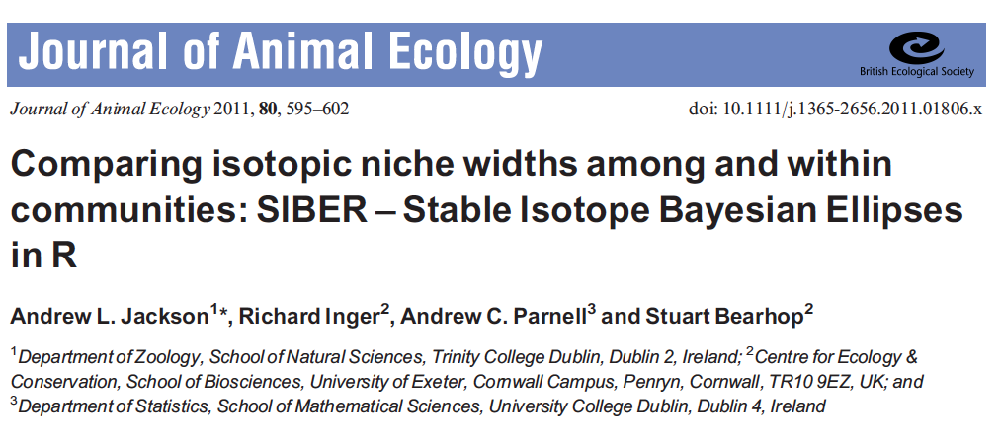
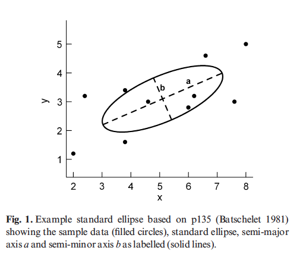
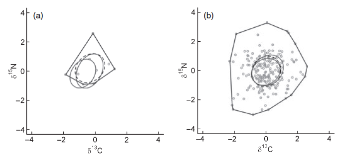
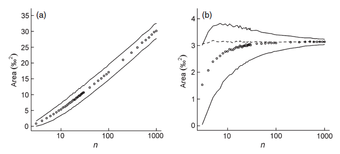
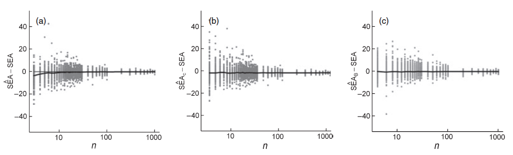
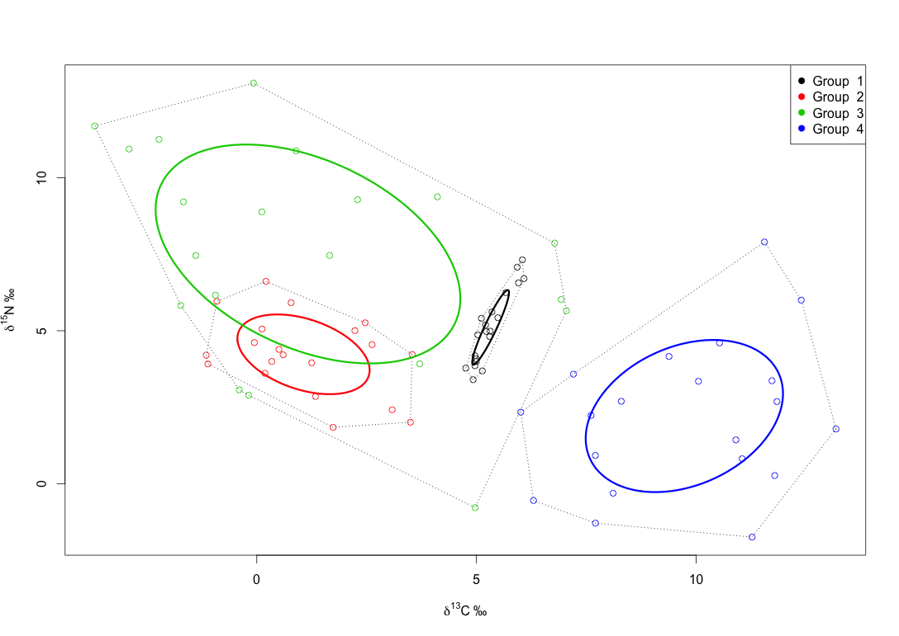

## Inference from d-space

> - Isotopes are like naturally occurring PCA analyses
> - They are two axes, behind which lie multiple biotic and physical factors
> - d15N tells us a lot about trophic level for example
> - d13C can tell us about marine Vs terrestrial among other scenopoetic factors
> - Idea is that isotopic niche correlates in some way with ecological niche

## Specialists Vs generalists


<div class="ref">Bearhop, Adam, Waldron, Fuller & MacLeod. 2004. Determining trophic niche width: a novel approach using stable isotope analysis. J Anim Ecol.</div>

## Drivers of niche width


<div class="ref">Layman et al. 2007. Niche width collapse in a resilient top predator following ecosystem fragmentation.</div>

## Invasive species


<div class="ref">Jackson, M.C. et al. 2012. Population-Level Metrics of Trophic Structure Based on Stable Isotopes and Their Application to Invasion Ecology. PLoSONE. </div>


## The problem with convex hulls
They can only get bigger.

```{r, echo=FALSE, message=FALSE, fig.width = 4, fig.height = 4}

library(siar)

set.seed(2)

X <- matrix(stats::rnorm(20), ncol = 2)

plot(X, cex = 1, asp = 1, xlim=c(-2.5,2.5), ylim=c(-2.5, 2.5), bty="L", pch = 15)
hpts <- chull(X)
hpts <- c(hpts, hpts[1])
lines(X[hpts, ])

Z <- matrix(stats::rnorm(10), ncol = 2)
points(Z, col="red", pch=16)

ZX <- rbind(Z,X)
hpts <- chull(ZX)
hpts <- c(hpts, hpts[1])
lines(ZX[hpts, ], col = "red", lty = 2)

```

## SIBER




## The standard ellipse



- a = semi-major axis length
- b = semi-minor axis length
- `Area = pi*a*b`
- contains ~= 40% of the data
- located by the means of X and Y
- shape and size determined by covariance matrix Sigma

## Uncertainty of the ellipse



## Sample size, ellipses and hulls



a = Hulls & b = Ellipses

## Sample size and bias in ellipse estimation



a = SEA, b = SEAc and c = SEA_B


## SIBER has two quite different routines

- Question is: do you want to compare populations within a community, or make comparisons across entire communities?

```{r, echo=FALSE, message = FALSE, fig.width = 7, fig.height = 3.5}

library(siar, quietly = TRUE,
        verbose = FALSE,
        logical.return = FALSE)

source("utility-scripts/plot.siber.data.r")

par(mfrow=c(1,2))

M <- plot.siber.data("data/example_layman_data.csv",
                tt = "Community 1", add.hull = F)

M <- plot.siber.data("data/example_layman_data_2.csv",
                tt = "Community 2", add.hull = F)

```

## Comparisons of populations



## SIBER output


## Other ways one might compare populations


