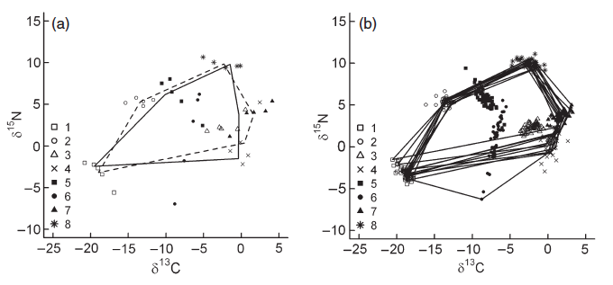

## Comparisons of communities

```{r, echo=FALSE, message = FALSE, fig.width = 7, fig.height = 3.5}

library(SIBER, quietly = TRUE,
        verbose = FALSE,
        logical.return = FALSE)

library(tidyverse)
library(magrittr)


# source("utility-scripts/plot.siber.data.r")

# import community 1 example and make sure dataframe names match 
# those expected by SIBER
comm1 <- read.csv("data/example_layman_data.csv", header=T)
comm1 %<>% transmute(iso1 = x, iso2 = y, group = group, community = 1)

# import community 2 example and make sure dataframe names match 
# those expected by SIBER
comm2 <- read.csv("data/example_layman_data_2.csv", header=T)
comm2 %<>% transmute(iso1 = x, iso2 = y, group = group, community = 1)


# Create the SIBER objects
comm1_siber <- createSiberObject(comm1)
comm2_siber <- createSiberObject(comm2)


par(mfrow=c(1,2))

plotSiberObject(comm1_siber, 
                ellipses = FALSE, 
                community.hulls.args = list(col = 1, lty = 1, lwd = 2))


plotSiberObject(comm2_siber, 
                ellipses = FALSE, 
                community.hulls.args = list(col = 1, lty = 1, lwd = 2))

```

## Based on the ellipse method
... but with an extra step


## Layman metrics

> - __TA__ - the area of convex hull containing, in the case of SIBER, the means of the populations that comprise the community.
> - __dN_range__ - the distance in units between the min and max y-axis populations means which is most often d15Nitrogen in ecological studies.
> - __dC_range__ - the distance in units between the min and max x-axis population means which is most often d13Carbon in ecological studies.
> - __CD__ - the mean distance to centroid from the means
> - __MNND__ - the mean nearest neighbour distance of the means
> - __SDNND__ - the standard deviation of the nearest neighbour distance

## Calculate metrics based on ellipses fitted to populations



## Fit Bayesian model (dummy slide)

```{r, echo=FALSE, message = FALSE, fig.width = 7, fig.height = 4.5}

# read in some data

# calculate the Bayesian Layman metrics given data for Isotopes 1 and 2, 
# a grouping variable Group and a number of iterations to use to generate
# the results
# options for running jags
parms <- list()
parms$n.iter <- 2 * 10^4   # number of iterations to run the model for
parms$n.burnin <- 1 * 10^3 # discard the first set of values
parms$n.thin <- 10     # thin the posterior by this many
parms$n.chains <- 2        # run this many chains

# define the priors
priors <- list()
priors$R <- 1 * diag(2)
priors$k <- 2
priors$tau.mu <- 1.0E-3

# fit the ellipses which uses an Inverse Wishart prior
# on the covariance matrix Sigma, and a vague normal prior on the 
# means. Fitting is via the JAGS method.
comm1_posterior <- siberMVN(comm1_siber, parms, priors)
comm2_posterior <- siberMVN(comm2_siber, parms, priors)


# extract the posterior means
comm1_mu_post <- extractPosteriorMeans(comm1_siber, comm1_posterior)
comm2_mu_post <- extractPosteriorMeans(comm2_siber, comm2_posterior)

# calculate the corresponding distribution of layman metrics
comm1_layman <- bayesianLayman(comm1_mu_post)
comm2_layman <- bayesianLayman(comm2_mu_post)


```

## Bayesian Convex Hulls (TA)

```{r, echo=FALSE, message = FALSE, fig.width=8}
# ------------------------------------------------------------------------------
# Plot out the results
# ------------------------------------------------------------------------------


# in this example, I plot TA as a histogram seperately to the other
# metrics as it is usually on a scale so vastly different from the other 
# metrics. TA is third column entry in the output from above.
#dev.new()
par(mfrow = c(1,2))

# use cbind() to put the TA from community 1 and 2 together for plotting side
# by side.
siberDensityPlot(comm1_layman[[1]] %>% as_tibble %>% select(TA) %>% as.matrix, 
                 xticklabels = "TA", 
                bty="L", 
                ylim = c(0,70), 
                xlab = "Community 1")

siberDensityPlot(comm2_layman[[1]] %>% as_tibble %>% select(TA) %>% as.matrix, 
                 xticklabels = "TA",
                bty="L", ylim = c(0,70), 
                xlab = "Community 2")
```


## And the other 5 metrics

```{r, echo=FALSE, message = FALSE, fig.width = 8, fig.height = 4.5}

# ------------------------------------------------------------------------------
# Plot out the results
# ------------------------------------------------------------------------------


# in this example, I plot TA as a histogram seperately to the other
# metrics as it is usually on a scale so vastly different from the other 
# metrics. TA is third column entry in the output from above.
#dev.new()
par(mfrow = c(1,2))

# use cbind() to put the TA from community 1 and 2 together for plotting side
# by side.
siberDensityPlot(comm1_layman[[1]] %>% as_tibble %>% select(-TA) %>% as.matrix, 
                 xticklabels = c("dY", "dX", "CD", "NND", "SD"), 
                bty="L", ylim = c(0,20),
                xlab = "Community 1")

siberDensityPlot(comm2_layman[[1]] %>% as_tibble %>% select(-TA) %>% as.matrix, 
                 xticklabels = c("dY", "dX", "CD", "NND", "SD"),
                bty="L", ylim = c(0,20),
                xlab = "Community 2")
```


