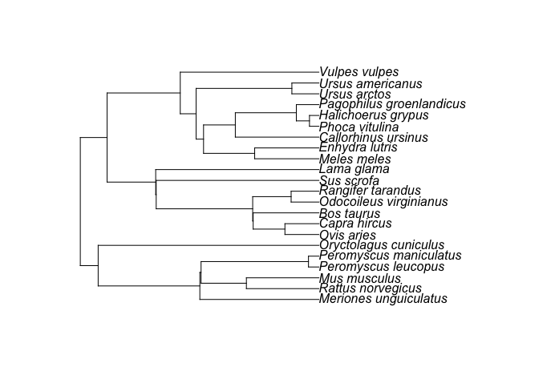

## Trophic Discrimination Factors
> - You are what you eat plus a few permil
> - The "few permil" are important in SIMMs
> - lots of names:
>     - Fractionation factors (denoted $\Delta$)
>     - (Trophic) Discrimination factors
>     - Trophic Enrichment factors
>     - Offsets
>     - not always positive, e.g. aphids feeding on phloem

## Knowing the TDF matters

```{r tef-effects, echo=FALSE, message = FALSE, fig.width = 7, fig.height = 5}
library(viridis)
palette(viridis(3))

x <- c(-10, -5)

tdf <- c(0, 1, 2)

plot(rep(x, 3), sort(rep(tdf,2)), pch = 15, col = rep(c(1,3), 3), cex = 4,
     ylim = c(-1, 3), axes = FALSE, xlab = "", ylab = "", 
     main = "Three diets of 50:50")
axis(1, at = -10:-5)
mtext("d13C", 1, line = 3, cex = 2)
axis(2, at = tdf, las = 1)
mtext("TDF", 2, line = 2, cex = 2)
points(mean(x) + 0, 0, pch = 16, col = 2, cex = 4)
lines(x, c(0,0), lty = 2, col = "grey")
points(mean(x) + 1, 1, pch = 16, col = 2, cex = 4)
lines(x, c(1,1), lty = 2, col = "grey")
points(mean(x) + 2, 2, pch = 16, col = 2, cex = 4)
lines(x, c(2,2), lty = 2, col = "grey")
```

## They affect the estimates of diet
> - They alter the geometry of sources and mixtures
> - They move mixtures closer or further away from their sources
> - They add uncertainty to the system

## How do we get them for our species?
> - Controlled feeding experiments
>    - let your species's tissue reach equilibrium with a food
>    - change the food to a different isotope $\delta$
>    - wait until tissue at equilibrium again
>    - return to original diet
>    - gives you tissue turn-over rates and TDF
- Often impractical
- In many cases impossible

## Current Alternatives
> - find a value for a related species or functionally similar species
> - use a generic value for your taxonomic group e.g. 
>    - +3.5 for $\delta^{15}\text{N}$
>    - +1.3 for $\delta^{13}\text{C}$

## SIDER
> - Stable Isotope Discrimination Estimation in R
> - A Bayesian regression model for estimation (prediction) of TDFs for $\delta^{15}\text{N}$ and $\delta^{13}\text{C}$
> - Uses phylogenetic regression to draw inference from related species whose TDFs are known.
> - Accounts for multiple observations on the same species via a random term
> - Also uses ecological information on diet type to improve prediction
> - Fitted model based on existing data which can be expanded in the future to include more: species, tissues and isotopes.
> - Returns a posterior distribution for the estimate which can be passed to SIMMs as mean +/- standard deviation.

## Mammals in SIDER
You can add in your own species as long as it is in the larger mammal tree (Kuhn et al 2011) or the bird tree (Jetz et al 2012). You can add species for which there already exists TDF data or for which the TDF data is missing.


## Explantory variables
The following explanatory variables are required to estimate the TDF for your species
> - Habitat:
>    - terrestrial
>    - marine
> - Tissue
>    - liver / blood / kidney / muscle / *hair* / **milk** / **feather** / **claws** / collagen
> - Diet type
>     - herbivore, carnivore, omnivore, *pellet*

## Imputation of the missing TDFs
> - The value for either $\delta^{15}\text{N}$ and $\delta^{13}\text{C}$ are then entered as `NA` in the corresponding column
> - during the MCMC process, these `NA`s are then imputed naturally during the model fitting
> - information is drawn from the other data via the linear regression model fitted using the `MCMCglmm` package.
>    - Fixed part: `delta13C ~ diet.type + habitat`
>    - Random part:   `~ animal + sp.col + tissue`

## Model Output
> - A full posterior distribution of the TDF(s) for which you provided expantory variable information but no TDF.
> - You can summarise this as a mean and standard deviation for further inclusion in a SIMM
> - How do we know this model works?


