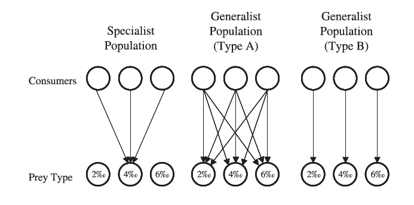
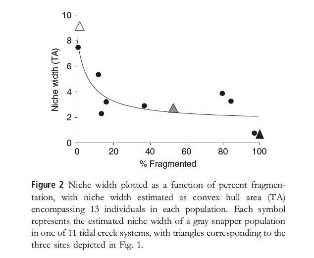
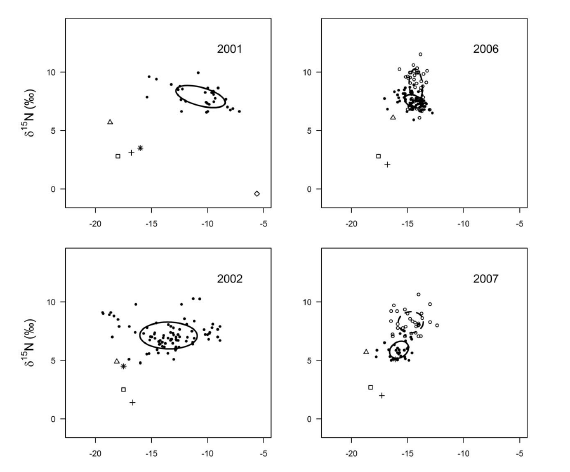
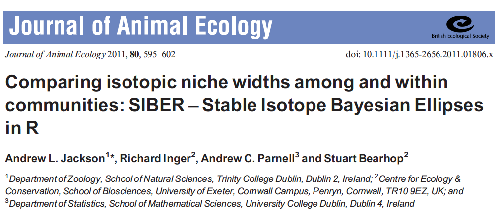
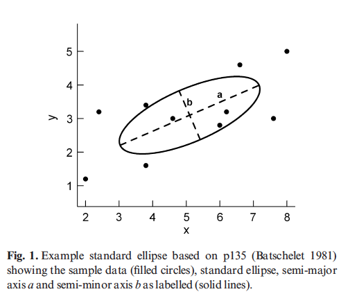
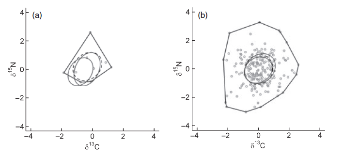
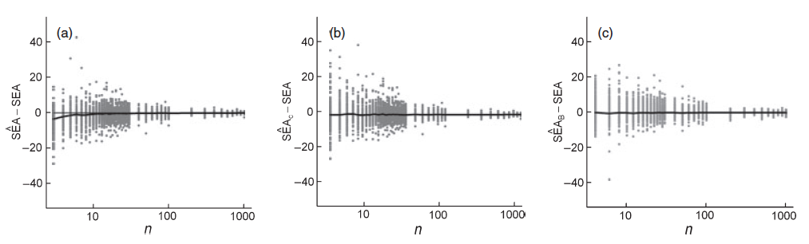
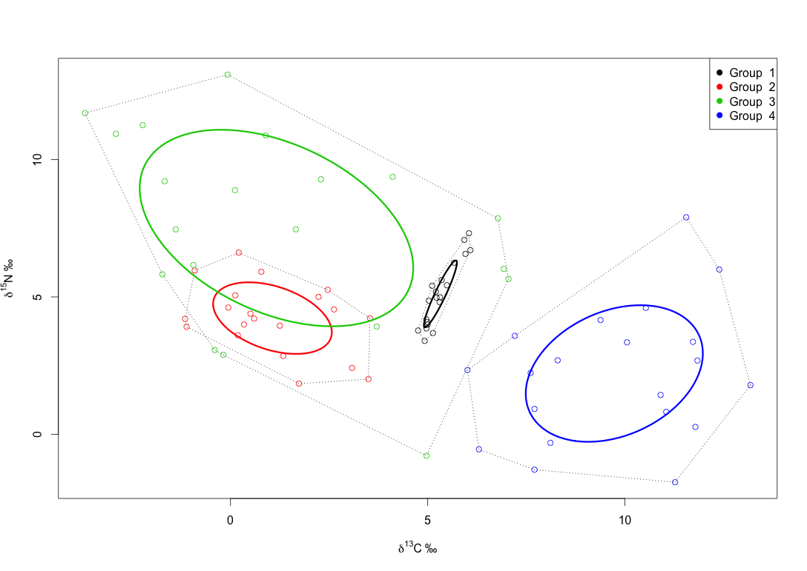
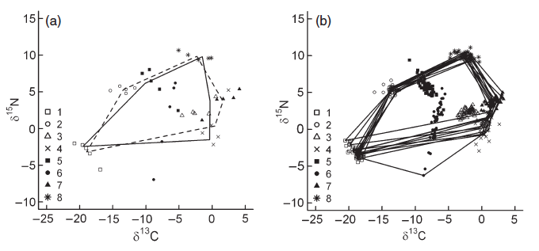

## Inference from d-space

> - Isotopes are like naturally occurring PCA analyses
> - They are two axes, behind which lie multiple biotic and physical factors
> - d15N tells us a lot about trophic level for example
> - d13C can tell us about marine Vs terrestrial among other scenopoetic factors
> - Idea is that isotopic niche correlates in some way with ecological niche

## Specialists Vs generalists



<div class="ref">Bearhop, Adam, Waldron, Fuller & MacLeod. 2004. Determining trophic niche width: a novel approach using stable isotope analysis. J Anim Ecol.</div>

## Drivers of niche width



<div class="ref">Layman et al. 2007. Niche width collapse in a resilient top predator following ecosystem fragmentation.</div>

## Invasive species



<div class="ref">Jackson, M.C. et al. 2012. Population-Level Metrics of Trophic Structure Based on Stable Isotopes and Their Application to Invasion Ecology. PLoSONE. </div>


## The problem with convex hulls
They can only get bigger.

```{r, echo=FALSE, message=FALSE, fig.width = 4, fig.height = 4}

set.seed(2)

X <- matrix(stats::rnorm(20), ncol = 2)

plot(X, cex = 1, asp = 1, xlim=c(-2.5,2.5), ylim=c(-2.5, 2.5), bty="L", pch = 15)
hpts <- chull(X)
hpts <- c(hpts, hpts[1])
lines(X[hpts, ])

Z <- matrix(stats::rnorm(10), ncol = 2)
points(Z, col="red", pch=16)

ZX <- rbind(Z,X)
hpts <- chull(ZX)
hpts <- c(hpts, hpts[1])
lines(ZX[hpts, ], col = "red", lty = 2)

```

## SIBER




## The standard ellipse



- a = semi-major axis length
- b = semi-minor axis length
- `Area = pi*a*b`
- contains ~= 40% of the data
- located by the means of X and Y
- shape and size determined by covariance matrix Sigma

## Uncertainty of the ellipse



## Sample size, ellipses and hulls


a = Ellipses & b = Hulls

## Sample size and bias in ellipse estimation



a = SEA, b = SEAc and c = SEA_B


## SIBER has two quite different routines

- Question is: do you want to compare populations within a community, or make comparisons across entire communities?

```{r, echo=FALSE, message = FALSE, fig.width = 7, fig.height = 3.5}

library(siar, quietly = TRUE,
        verbose = FALSE,
        logical.return = FALSE)

source("plot.siber.data.r")

par(mfrow=c(1,2))

M <- plot.siber.data("../siber-scripts/example_layman_data.csv",
                tt = "Community 1", add.hull = F)

M <- plot.siber.data("../siber-scripts/example_layman_data_2.csv",
                tt = "Community 2", add.hull = F)

```

## Comparisons of populations



## SIBER output


## Comparisons of communities

```{r, echo=FALSE, message = FALSE, fig.width = 7, fig.height = 3.5}

library(siar, quietly = TRUE,
        verbose = FALSE,
        logical.return = FALSE)

source("plot.siber.data.r")

par(mfrow=c(1,2))

M <- plot.siber.data("../siber-scripts/example_layman_data.csv",
                tt = "Community 1", add.hull = T)

M <- plot.siber.data("../siber-scripts/example_layman_data_2.csv",
                tt = "Community 2", add.hull = T)

```

## Layman metrics

> - __TA__ - the area of convex hull containing, in the case of SIBER, the means of the populations that comprise the community.
> - __dN_range__ - the distance in units between the min and max y-axis populations means which is most often d15Nitrogen in ecological studies.
> - __dC_range__ - the distance in units between the min and max x-axis population means which is most often d13Carbon in ecological studies.
> - __CD__ - the mean distance to centroid from the means
> - __MNND__ - the mean nearest neighbour distance of the means
> - __SDNND__ - the standard deviation of the nearest neighbour distance

## Calculate metrics based on ellipses fitted to populations



## Bayesian Convex Hulls (TA)

```{r, echo=FALSE, message = FALSE, fig.width = 7, fig.height = 4.5}

# read in some data
comm1 <- read.csv("../siber-scripts/example_layman_data.csv", header=T)

comm2 <- read.csv("../siber-scripts/example_layman_data_2.csv", header=T)

# calculate the Bayesian Layman metrics given data for Isotopes 1 and 2, 
# a grouping variable Group and a number of iterations to use to generate
# the results
metrics.comm1 <- siber.hull.metrics(comm1$x, comm1$y, comm1$group, R=10^4)

metrics.comm2 <- siber.hull.metrics(comm2$x, comm2$y, comm2$group, R=10^4)

# ------------------------------------------------------------------------------
# Plot out the results
# ------------------------------------------------------------------------------

# these are the names of each of the metrics taken from the fitted model
xlabels <- attributes(metrics.comm1)$dimnames[[2]]

# in this example, I plot TA as a histogram seperately to the other
# metrics as it is usually on a scale so vastly different from the other 
# metrics. TA is third column entry in the output from above.
#dev.new()
par(mfrow = c(1,1))

# use cbind() to put the TA from community 1 and 2 together for plotting side
# by side.
siardensityplot(cbind(metrics.comm1[,3], metrics.comm2[,3]),
                xlab = "Community", 
                ylab = expression('TA  \u2030'^2), 
                bty = "L")

```

## And the other 5 metrics

```{r, echo=FALSE, message = FALSE, fig.width = 7, fig.height = 4.5}

par(mfrow = c(1,2))

siardensityplot(metrics.comm1[,c(1,2,4,5,6)],
                xticklabels = xlabels[c(1,2,4,5,6)],
                ylims = c(0,25),
                ylab = expression('\u2030'),
                xlab = "Metric",
                main = "Community 1",
                bty = "L")

siardensityplot(metrics.comm2[,c(1,2,4,5,6)],
                xticklabels = xlabels[c(1,2,4,5,6)],
                ylims = c(0,25),
                ylab = expression('\u2030'),
                xlab = "Metric", 
                main = "Community 2",
                bty = "L")

```


