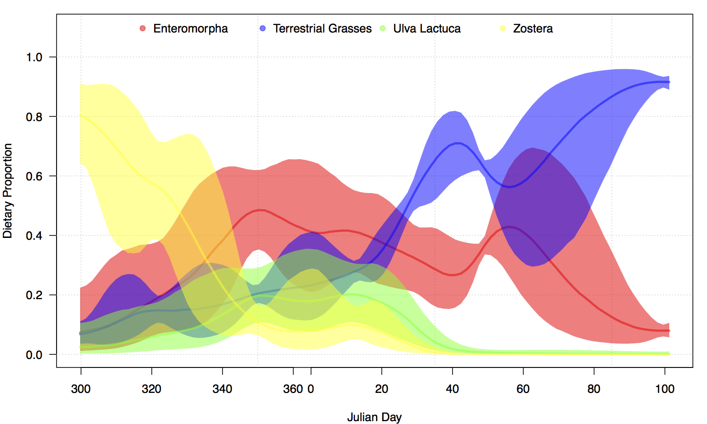

## Learning outcomes

- Revision on everything we’ve covered
- Tips for building your own SIMM in JAGS
- Splines, and using them in SIMMs
- Future extensions for SIMMs

## Revision: a starter SIMM script

```{r,eval=FALSE}
modelstring ='
model {
  for(i in 1:N) { 
    for(j in 1:J) {
      y[i,j] ~ dnorm(inprod(p*q[,j],s[,j]+c[,j])/inprod(p,q[,j]),sigma[j]^-2)
    }
  }
  for(k in 1:K) { 
    for(j in 1:J) {
      s[k,j] ~ dnorm(s_mean[k,j],s_sd[k,j]^-2) 
      c[k,j] ~ dnorm(c_mean[k,j],c_sd[k,j]^-2) 
    }
  }
  p ~ ddirch(alpha)
  for(j in 1:J) { sigma[j] ~ dunif(0,10) }
}
'
```

## Revision: a more advanced SIMM script {.smaller}

```{r,eval=FALSE}
modelstring ='
model {
  for (i in 1:N) {
    for (j in 1:J) { 
      y[i,j] ~ dnorm(inprod(p[i,]*q[,j], s_mean[,j]+c_mean[,j]) / inprod(p[i,],q[,j]), 1/var_y[i,j])
      var_y[i,j] <- inprod(pow(p[i,]*q[,j],2),s_sd[,j]^2+c_sd[,j]^2)/pow(inprod(p[i,],q[,j]),2) 
        + pow(sigma[j],2)
    }
  }
  for(i in 1:N) {
    p[i,1:K] <- expf[i,]/sum(expf[i,])
    for(k in 1:K) {
      expf[i,k] <- exp(f[i,k])
      f[i,k] ~ dnorm(mu_f[k],sigma_f[k]^-2)
    }
  }
  for(k in 1:K) { 
    mu_f[k] ~ dnorm(0,1)
    sigma_f[k] ~ dgamma(2,1)
  }
  for(j in 1:J) { sigma[j] ~ dunif(0,10) }
}
'
```


## Tips for building your own SIMM

- If your data are small and relatively simple, a standard Dirichlet/SIAR-type model will work fine
- If your data contain covariates or contain interestingly arranged sources (as evidenced by the iso-space plot) use the more advanced JAGS script or MixSIAR
- Think carefully about prior distributions. Which parameters do you have information about? Which parameters do you need to constrain to fit the model properly?
- Always check convergence, and see if the results match the iso-space plots

## New topic: splines

- Often we don't want to fit a straight line relationship between our covariate(s) and our response
- For example, the relationship might be quadratic, cubic, or completely non-linear
- Splines are a neat method for exploring non-linear relationships between covariates and the response
- They work by replacing the covariate with _basis functions_ defined at _knots_. A standard regression model is fitted to these basis functions with an extra constraint to make sure the results are smooth
- Often you will hear these types of models referred to as _non-parametric_ which is a bit of a misnomer, since they contain lots of parameters!

## Simple splines example
- Consider fitting a model to some data where the response is non-linear
```{r,include=FALSE}
library(rjags)
setwd("~/GDrive/Conferences&Talks/SIAR_Glasgow_Jan16/ap_notes/mod_10_building_simms")
source('Create_spline_data.R')
```
```{r,fig.align='center',fig.height=4}
par(mar=c(3,3,2,1), mgp=c(2,.7,0), tck=-.01,las=1)
plot(t,p,xlab='time',ylab='dietary proportion')
```

## Fitting a model with polynomial regression
```{r,results='hide'}
modelstring ='
model {
  for(i in 1:N) { p[i] ~ dnorm(mu[i],sigma^-2) }
  mu <- B%*%beta
  for(l in 1:L) { beta[l] ~ dnorm(0,0.01) }
  sigma ~ dunif(0,1000)
}'
B = cbind(1,t,t^2,t^3)
data=list(p=p,N=length(p),B=B,L=ncol(B))
model=jags.model(textConnection(modelstring), data=data,n.chain=3)
output=coda.samples(model=model,variable.names=c("beta","sigma"),n.iter=100000,thin=100)
```
Look how many iterations are required for convergence! This also gets very unstable once you get beyond cubic


## Output from polynomial regression
```{r,fig.align='center',fig.height=3}
beta_mean = summary(output)$statistics[1:data$L,1]
par(mar=c(3,3,2,1), mgp=c(2,.7,0), tck=-.01,las=1)
plot(t,p,xlab='time',ylab='dietary proportion')
lines(t,B%*%beta_mean,col='red')
```

## An alternative: B-spline basis functions

```{r,include=FALSE}
source('Create_spline_data.R')
```
```{r,fig.align='center',fig.height=4}
source('bases.r')
B = bbase(t)
plot(t,p,xlab='time',ylab='dietary proportion',ylim=c(0.3,0.6))
for(i in 1:ncol(B)) lines(t,B[,i]/10+0.3,col=i,lwd=2)
```

## Splines in JAGS

```{r,results='hide'}
modelstring ='
model {
  for(i in 1:N) { p[i] ~ dnorm(mu[i],sigma^-2) }
  mu <- B%*%beta
  beta[1] ~ dnorm(0,100^-2)
  for(l in 2:L) { beta[l] ~ dnorm(beta[l-1],sigma_beta^-2) }
  sigma_beta ~ dunif(0,10)
  sigma ~ dunif(0,1000)
}'
B = bbase(t)
data=list(p=p,N=length(p),B=B,L=ncol(B))
model=jags.model(textConnection(modelstring), data=data,n.chain=3)
output=coda.samples(model=model,variable.names=c("beta","sigma"),n.iter=1000)
```

## Output from spline model
```{r,fig.align='center',fig.height=3}
beta_mean = summary(output)$statistics[1:data$L,1]
par(mar=c(3,3,2,1), mgp=c(2,.7,0), tck=-.01,las=1)
plot(t,p,xlab='time',ylab='dietary proportion')
lines(t,B%*%beta_mean,col='red')
```

## Some more notes on splines

- You can vary the smoothness of the splines by increasing the number of basis functions (i.e. the number of knots), or changing the prior on the smoothness parameter (here `sigma_beta`)
- It's usually best to put more knots in than you need and to constrain the smoothness parameter
- This will converge to a neater result far, far, faster than the polynomial version, and be able to capture more wiggly behaviour
- Like, every other topics we have met, we can insert these ideas into a SIMM as the prior structure on the dietary proportions...

## Splines and the Geese data

- Model available in file `run_spline_geese.R` file
- Main change in code is:
```{r,eval=FALSE}
modelstring ='
model {
  ...
  for(k in 1:K) { 
    f[1:N,k] <- B%*%beta[,k]
    beta[1,k] ~ dnorm(0,100^-2)
    for(l in 2:L) { beta[l,k] ~ dnorm(beta[l-1,k],sigma_beta[k]^-2) }
    sigma_beta[k] ~ dunif(0,10)
  }
  ...
}
'
```

## Output from spline SIMM model

<center></center>

## Some more advanced topics: time series models

- A standard way to analyse data that are observed over time is to use an _auto-regressive_ model, e.g.
$$y_t = \alpha + \beta y_{t-1} + \epsilon_t$$
- Here each value of $y$ at time $t$ depends on the value of $y$ at time $t-1$, known as an AR(1) model
- This type of model turns out to be very useful for analysing stocks and shares, climate change, etc, etc
- A related model is the _random walk_:
$$y_t = \alpha + y_{t-1} + \epsilon_t$$
- This can be extended in all kinds of ways to continuous time, stochastic volatility (changing variance of $\epsilon$), multivariate

## Time series and SIMMs

It's possible to put in an autoregressive term in a SIMM:
```{r,eval=FALSE}
modelstring ='
model {
  ...
  for(i in 1:N) {
    p[i,1:K] <- expf[i,]/sum(expf[i,])
    for(k in 1:K) {
      expf[i,k] <- exp(f[time[i],k])
    }
  }
  for(k in 1:K) { 
    f[1,k] ~ dnorm(0,100^-2)
    for(t in 2:N_t) { f[t,k] ~ dnorm(alpha[k] + beta[k]*f[t-1],k],1/sigma_f[k])}
    ...
  }
  ...
}
'
```

## Advanced topics: clustering

- A popular method for clustering data in a Bayesian model is to use a _mixture model_:
$$\pi(y_i) = \sum_{g=1}^G \tau_g \pi_g(y_i|\theta_g)$$
where $\pi_g$ is an individual normal density, and $\tau_g$ are weights which sum to 1
- This looks a bit like our SIMM, except for in a SIMM we have a mixture on the means, whereas this is a mixture on the entire density
- Each normal distribution has its own mean/variance so acts like an individual cluster
- The idea is often to identify the number of clusters $G$

## Clustering example

<center></center>

## Clustering in SIMMs

- Various places where clustering might be useful in a SIMM
- Perhaps the sources/TEFs are unknown mixtures of two sources and you want to separate them
- Perhaps the consumers are from multiple (undefined) groups based on dietary proportion and you want to discover which group they belong to

## Clustering dietary proportions

```{r,eval=FALSE}
modelstring ='
model {
  ...
  for(k in 1:K) { 
    for(i in 1:N) { 
      mu_f[i,k] <- lambda[T[i,k],k]
      T[i,k] ~ dcat(pi[,k])
    }
    pi[,k] ~ ddirch(alpha)
  }
  ...
}
'
```

## Advanced topics: zero-inflation

- What if some of the consumers aren't eating any of some sources?
- SIAR/MixSIAR will give this value a very small proportion, but it will never set the value to exactly zero
- If you could find a model that sets some dietary proportions to zero you could put in a larger number of sources and see which ones the model sets to zero
- 'Shrinkage' models very popular in statistics research
- No easy way to put these into JAGS!

## Summary

- Ideally use a JAGS SIMM script to run your own SIMM model. If not use MixSIAR
- Splines a really useful way of doing non-linear smoothing
- Some advanced topics not yet implemented in SIMMs - very fertile avenue for further and collaboration

<center>THANK YOU FOR LISTENING!</center>
