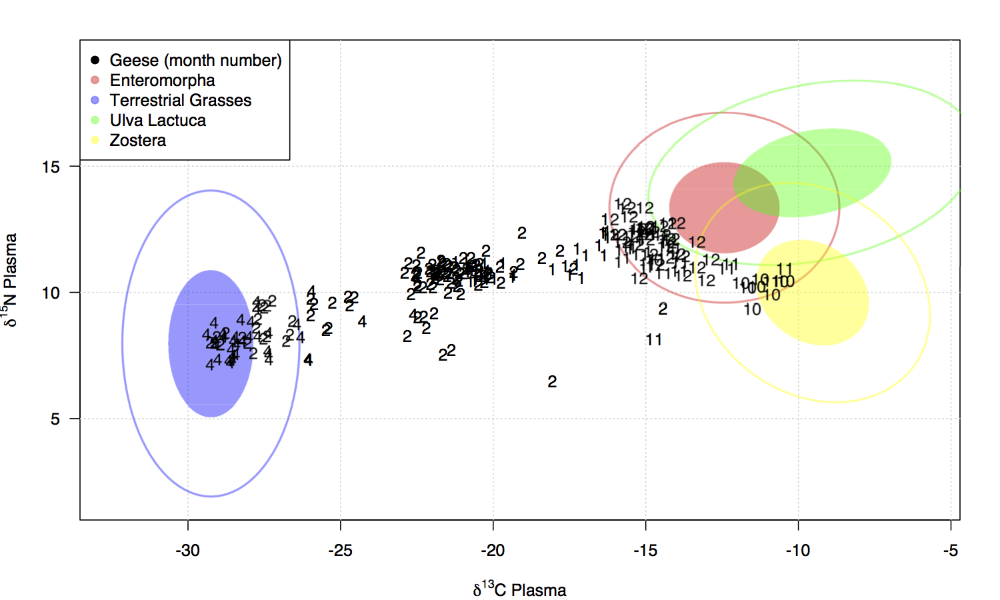
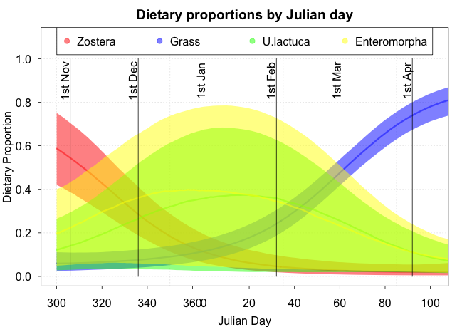

## Learning outcomes
- Understand how multivariate distributions might better capture variability in sources and dietary proportions
- Understand how richer covariates might be included in a SIMM
- Understand how to compare models using DIC

## Revision: our best SIMM in JAGS {.smaller}

```{r}
modelstring ='
model {
  for (i in 1:N) {
    for (j in 1:J) { 
      y[i,j] ~ dnorm(inprod(p[i,]*q[,j], s_mean[,j]+c_mean[,j]) / inprod(p[i,],q[,j]), 1/var_y[i,j])
      var_y[i,j] <- inprod(pow(p[i,]*q[,j],2),1/s_prec[,j]+1/c_prec[,j])/pow(inprod(p[i,],q[,j]),2) 
        + pow(sigma[j],2)
    }
  }
  for(i in 1:N) {
    p[i,1:K] <- expf[i,]/sum(expf[i,])
    for(k in 1:K) {
      expf[i,k] <- exp(f[i,k])
      f[i,k] ~ dnorm(mu_f[k],1/pow(sigma_f[k],2))
    }
  }
  for(k in 1:K) { 
    mu_f[k] ~ dnorm(0,1)
    sigma_f[k] ~ dgamma(2,1)
  }
  for(j in 1:J) { sigma[j] ~ dunif(0,10) }
}
'
```

## Key features

- The key features of our current SIMM are:

  1. We are accounting for uncertainty in sources and TEFs
  2. Individual dietary proportions are provided for each consumer, arising from an overall mean
  3. The dietary proportions are linked to normal distributions via the _centralised log-ratio_ (CLR) transform

- Some remaining restrictions

  1. We still haven't seen code that incorporates covariates
  2. The sources, TEFs and consumers, are all assumed to be independent across isotope (i.e. 'circular' on an isospace plot). Could there by covariance between them?

## The multivariate normal distribution

- The multivariate normal (MVN) distribution will account for covariance (i.e. correlation) between data or parameters
- The MVN takes a mean vector $M$ and a variance matrix $V$ as its two arguments. $M$ represents the mean of each element, whilst $V$ contains the variances and covariances between the elements
- In JAGS, the MVN distribution is represented by `dmnorm` function, which takes the _precision_ rather than the variance matrix, similar to `dnorm`

## MVN example - Old faithful data

```{r,fig.align='center'}
data(faithful)
plot(faithful,xlab='Eruption length (minutes)',ylab='Waiting time (minutes)',las=1)
```

## MVN example - JAGS code

```{r,include=FALSE}
library(rjags)
```
```{r,results='hide'}
modelstring ='
model {
  for(i in 1:N) { y[i,] ~ dmnorm(M,V_inv) }
  V_inv <- inverse(V)
  V[1,1] <- pow(sigma[1],2)
  V[2,1] <- rho*sigma[1]*sigma[2]
  V[2,2] <- pow(sigma[2],2)
  V[1,2] <- V[2,1]
  for(j in 1:2) { 
    M[j] ~ dnorm(0,0.001) 
    sigma[j] ~ dunif(0,1000)
  }
  rho ~ dunif(-1,1)
}'
data=list(y=faithful,N=nrow(faithful))
model=jags.model(textConnection(modelstring), data=data)
output=coda.samples(model=model,variable.names=c("sigma","M","rho"),n.iter=1000)
```

## MVN output 1

```{r,fig.align='center',fig.height=3.5}
summary(output)$statistics
```


## MVN output 2

```{r,fig.align='center',fig.height=3.5}
library(MASS)
post_mean = mvrnorm(10000,mu=c(3.45,70.4),Sigma=
                      matrix(c(1.14^2,0.898*1.14*13.59,0.898*1.14*13.59,
                               13.59^2),2,2))
plot(faithful)
contour(kde2d(post_mean[,1],post_mean[,2]),add=TRUE)
```


## Prior distributions for covariance matrices

- When working in only two dimensions it can be helpful to split up the covariance matrix into two variances/standard deviations and a correlation parameter
- When working in more than two dimensions this gets tricky. People often use the _Wishart_ distribution which is a probability distribution for covariance matrices
- Be careful when using the Wishart in high dimensions as it again suffers from some unrealistic restrictions on the resulting matrix 

## The MVN in a SIMM

```{r,include=FALSE}
modelstring ='
model {
  for(i in 1:N) { 
      y[i,] ~ dmnorm(M[i,],V_inv)
      for(j in 1:J) { M[i,j] <- inprod(p[i,]*q[,j],s[,j]+c[,j])/inprod(p[i,],q[,j]) }
  }
  V_inv <- inverse(V)
  V[1,1] <- pow(sigma[1],2)
  V[2,1] <- rho*sigma[1]*sigma[2]
  V[2,2] <- pow(sigma[2],2)
  V[1,2] <- V[2,1]
  for(j in 1:2) { 
    sigma[j] ~ dunif(0,100)
  }
  rho ~ dunif(-1,1)
  
  for(k in 1:K) { 
    for(j in 1:J) {
      s[k,j] ~ dnorm(s_mean[k,j],s_prec[k,j]) 
      c[k,j] ~ dnorm(c_mean[k,j],c_prec[k,j]) 
    }
  }
  for(i in 1:N) {
    p[i,1:K] <- expf[i,]/sum(expf[i,])
    for(k in 1:K) {
      expf[i,k] <- exp(f[i,k])
      f[i,k] ~ dnorm(mu_f[k],1/pow(sigma_f[k],2))
    }
  }
  for(k in 1:K) { 
    mu_f[k] ~ dnorm(0,1)
    sigma_f[k] ~ dgamma(2,1)
  }
}
'
library(siar)
data(geese1demo,sourcesdemo,correctionsdemo,concdepdemo)
con = geese1demo
sources = as.matrix(sourcesdemo[,2:5])
tefs = as.matrix(correctionsdemo[,2:5])
cd = as.matrix(concdepdemo[,c(2,4)])
data=list(y=con,s_mean=sources[,c(1,3)],s_prec=1/sources[,c(2,4)]^2,
          c_mean=tefs[,c(1,3)],c_prec=1/tefs[,c(2,4)]^2,
          q=cd,N=nrow(con),K=nrow(sources),
          J=ncol(con))
model=jags.model(textConnection(modelstring), data=data)
output=coda.samples(model=model,variable.names=c('sigma','mu_f','sigma_f','rho'),
                    n.iter=10000)
```

```{r,eval=FALSE}
modelstring ='
model {
  for(i in 1:N) { 
      y[i,] ~ dmnorm(M[i,],V_inv)
      for(j in 1:J) { M[i,j] <- inprod(p[i,]*q[,j],s[,j]+c[,j])/inprod(p[i,],q[,j]) }
  }
  V_inv <- inverse(V)
  V[1,1] <- pow(sigma[1],2)
  V[2,1] <- rho*sigma[1]*sigma[2]
  V[2,2] <- pow(sigma[2],2)
  V[1,2] <- V[2,1]
  for(j in 1:2) { 
    sigma[j] ~ dunif(0,100)
  }
  rho ~ dunif(-1,1)
  ...
}
'
```

## Output from the multivariate SIMM

```{r}
round(summary(output)$quantiles,3)
```

## Notes about the multivariate SIMM

- On this small data set there doesn't seem to be much strong evidence for the value of $\rho$ (note: this doesn't mean that it's not important - see later slides on model selection)
- Often it is more useful to put the multivariate normal distribution on the sources and TEFs rather than the isotope residuals
- To do this, simply re-use the earlier `faithful` example but with the raw source/TEF data, then use the means/variances/covariances in the prior distribution for $s$ and $c$ in the SIMM
- Another alternative is to put the MVN on the CLR transformed $f$ values - the model can now learn the dependencies between the dietary proportions

## Back to covariates

- Let's now create a model with covariates on the dietary proportions
- Recall that we can do this using the CLR transform on the $p$:
$$\left[ p_{i1},\ldots,p_{iK} \right] = \left[ \frac{\exp(f_{i1})}{\sum_j \exp (f_{ij})}, \ldots, \frac{\exp(f_{iK})}{\sum_j \exp (f_{ij})} \right]$$
- The prior goes on $f$, e.g.
$$f_{ik} = \alpha_k + \beta_k x_i$$
where $x_i$ is the covariate for observation $i$
- Much of the detailed maths for this work is in our 2013 Environmetrics paper
- The CLR allows for much more complex relationships between the dietary proportions

## Why the CLR?

- There is quite a bit of research to show that the Dirichlet distribution is not a good distribution to use for proportions because it suffers from a very rigid correlation structure
- The CLR doesn't suffer from this, but does have an extra restriction that all the $f$s must sum to zero. You can get round this by setting an informative prior
- There are others used too, including the additive log ratio (ALR) and the isometric log ratio (ILR). We recommend the CLR with an informative prior (different to MixSIAR)
- Lots of other distributions are widely used but often inappropriate: e.g. Poisson, $\chi^2$, normal(!)

## A SIMM with covariates
```{r,eval=FALSE}
modelstring ='
model {
  ...
  for(i in 1:N) {
    p[i,1:K] <- expf[i,]/sum(expf[i,])
    for(k in 1:K) {
      expf[i,k] <- exp(f[i,k])
      f[i,k] ~ dnorm(mu_f[i,k],1/pow(sigma_f[k],2))
    }
  }
  for(k in 1:K) { 
    for(i in 1:N) { mu_f[i,k] <- alpha[k] + beta[k]*x[i] }
    sigma_f[k] ~ dgamma(2,1)
    alpha[k] ~ dnorm(0,0.01)
    beta[k] ~ dnorm(0,0.01)
  }
  ...
}
'
```

## The Geese data

<center></center>

## A Fourier basis

- For the Geese data we don't want to use a linear covariate
- Instead we want to use a _Fourier_ covariate which measures how the dietary proportions change periodically
- We're going to structure our mean as:
$$f_{ik} = \alpha_k + \beta_k sin \left(\frac{2\pi x_i}{365} \right) + \gamma_k cos \left(\frac{2\pi x_i}{365} \right)$$
where $x_i$ is Julian day
- This will allow for periodic behaviour over 365 days. The sign and magnitude of the parameters $\alpha$ and $\beta$ will determine the shape of the periodic behaviour


## Model setup {.smaller}
```{r,include=FALSE,eval=FALSE}
modelstring ='
model {
  for(i in 1:N) { 
    for(j in 1:J) {
      y[i,j] ~ dnorm(inprod(p[i,]*q[,j],s[,j]+c[,j])/inprod(p[i,],q[,j]),1/pow(sigma[j],2))
    }
  }
  for(k in 1:K) { 
    for(j in 1:J) {
      s[k,j] ~ dnorm(s_mean[k,j],s_prec[k,j]) 
      c[k,j] ~ dnorm(c_mean[k,j],c_prec[k,j]) 
    }
  }
  for(i in 1:N) {
    p[i,1:K] <- expf[i,]/sum(expf[i,])
    for(k in 1:K) {
      expf[i,k] <- exp(f[i,k])
    }
  }
  for(k in 1:K) { 
    f[1:N,k] <- X[1:N,1:L]%*%beta[1:L,k]
  }
  for(l in 1:L) {
    for(k in 1:K) { beta[l,k] ~ dnorm(0,1) }
  }
  for(j in 1:J) { sigma[j] ~ dunif(0,10) }
}
'
#setwd("/Volumes/MacintoshHD2/GDrive/Conferences&Talks/SIAR_Glasgow/mod_8_timeseries_SIMMs")
setwd("~/Gdrive/Conferences&Talks/SIAR_Glasgow/SIMMR_shared/ap_notes/mod_8_complex_simms")
#setwd("~/GDrive/Conferences&Talks/SIAR_Glasgow/mod_8_complex_SIMMs")
con = read.csv('GeeseConsumers2.csv')
X = cbind(1,sin(2*pi*con$julianday/365),cos(2*pi*con$julianday/365))
data=list(y=con[,2:3],s_mean=sources[,c(1,3)],s_prec=1/sources[,c(2,4)]^2,
          c_mean=tefs[,c(1,3)],c_prec=1/tefs[,c(2,4)]^2,
          q=cd,N=nrow(con),K=nrow(sources),
          J=ncol(con[,2:3]),X=X,L=ncol(X))
model=jags.model(textConnection(modelstring), data=data, n.chains=3)
output=coda.samples(model=model,variable.names=c('p','beta','mu_f','sigma_f'),n.iter=10000,thin=100)
gelman.diag(output,multivariate = FALSE)
```

```{r,eval=FALSE}
modelstring ='
model {
  ...
  for(i in 1:N) {
    p[i,1:K] <- expf[i,]/sum(expf[i,])
    for(k in 1:K) { expf[i,k] <- exp(f[i,k]) }
  }
  for(k in 1:K) { 
    f[i,k] <- X[1:N,1:L]%*%beta[1:L,k]
  }
  for(l in 1:L) {
    for(k in 1:K) { beta[l,k] ~ dnorm(0,1) }
  }
  ...
}
'
```
Full script in `run_geese_harmonic.R` file

## Output

<center></center>

## Comparing models

- How do we know that this model fitted the data better than the model without covariates?
- How do we choose between models generally?
- These are very hard and open questions in the field of statistics

## A rough primer on model comparison

- $p$-values. The traditional way. These tell you very little about whether a parameter is important in the model
- Likelihood ratio tests (with $p$-values). A bit better. These compare how 'likely' the data is under one hypothesis vs the other.
- Information criteria. Idea here is to penalise the likelihood by some measure of 'model complexity', so as to choose models which fit the data well and are not too complex. We will use the _Deviance Information Criterion_ (DIC), which is already part of JAGS
- Bayes Factors. These are theoretically the gold standard in Bayesian hypothesis testing. However, they can be very sensitive to the choice of prior distribution
- Cross-validation. Obtained by removing portions of the data, fitting to the remainder, and then predicting values for the missing portion. Very useful for larger data sets

## The Deviance Information Criterion

- The DIC is defined as:
$$DIC = -2 \log L + 2p_D$$
where $L$ is the likelihood and $p_D$ is the _effective number of parameters_
- A smaller DIC indicates a 'better' model. DIC doesn't give any estimate of uncertainty so there is no way to discern exactly how small a jump is required to choose a model
- $p_D$ is approximately calculated as the difference between how well the model fits the data at the mean value of the parameters, and how well the model fits the data at the mean of the likelihood
- From JAGS, we can get DIC by running the extra command `dic.samples`. Note that the DIC sometimes takes much longer to converge than the parameters

## DIC example 1 - MVN model {.smaller}
 
```{r,eval=FALSE}
modelstring ='
model {
  for(i in 1:N) { y[i,] ~ dmnorm(M,V_inv) }
  V_inv <- inverse(V)
  V[1,1] <- pow(sigma[1],2)
  V[2,1] <- rho*sigma[1]*sigma[2]
  V[2,2] <- pow(sigma[2],2)
  V[1,2] <- V[2,1]
  for(j in 1:2) { 
    M[j] ~ dnorm(0,0.001) 
    sigma[j] ~ dunif(0,1000)
  }
  rho ~ dunif(-1,1)
}'
data=list(y=faithful,N=nrow(faithful))
model=jags.model(textConnection(modelstring), data=data,n.chains=4)
dic.samples(model,n.iter=2000)
# Mean deviance:  1585 
# penalty 5.09 
# Penalized deviance: 1590 
```

## DIC example 2 - standard normal model {.smaller}

```{r,eval=FALSE}
modelstring ='
model {
  for(i in 1:N) { y[i,] ~ dmnorm(M,V_inv) }
  V_inv <- inverse(V)
  V[1,1] <- pow(sigma[1],2)
  V[2,1] <- 0
  V[2,2] <- pow(sigma[2],2)
  V[1,2] <- 0
  for(j in 1:2) { 
    M[j] ~ dnorm(0,0.001) 
    sigma[j] ~ dunif(0,1000)
  }
}'
data=list(y=faithful,N=nrow(faithful))
model=jags.model(textConnection(modelstring), data=data,n.chains=4)
dic.samples(model,n.iter=2000)
# Mean deviance:  2038 
# penalty 4.122 
# Penalized deviance: 2042 
```

## Some final notes on the DIC

- DIC can be quite sensitive to model focus. Compare the model in the previous slide with that of a standard `dnorm` version of the same model
- The value of $p_D$ is useful. For simple models, it should be roughly the true number of parameters (e.g. 5 and 4 in the previous models). However, in hierarchical models in can be non-integer representing the fact that the parameters are shared between groups. In some cases $p_D$ can be negative!
- JAGS contains the option to create a 'superior' version of $p_D$ called `popt` which you specify via the `type` argument. This penalises extra parameters more harshly but isn't quite as interpretable. However, it is often more stable in more complicated models.

## Summary

- Multivariate normal distributions can add some extra richness to the model, if it is required
- We can add in rich covariate behaviour through the CLR, though need to be careful with priors
- DIC can help us choose between models. More complex models always fit the data better, but can often over-fit yielding poor predictive and explanatory performance


